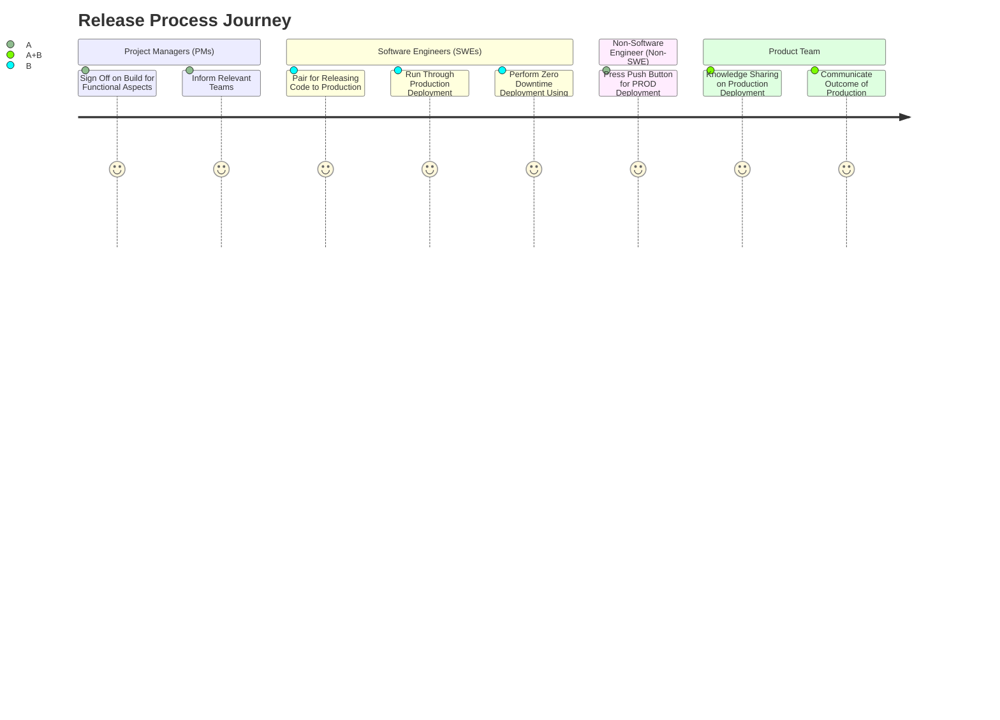

# Engineering Release Management
## The process:

- PMs sign off on the build for the functional aspects
- Communicate intent to deploy to production to the relevant teams (product team and line, dependency teams, operations)
- SWE’s work in pairs to release code to production
- 1 Non-SWE from the team (responsible for pressing the push button, required for separation of duties ONLY for PROD)
- 2 SWE from the product team (knowledge sharing the contents of the production deployment, e.g. reviewing PRs, quick demo of new - features, review the functional diff, review test)
- SWE’s run through a production deployment checklist of tasks before deploying to production
- SWE’s perform a zero downtime deployment using automation
- Communicate the outcome of the production to the relevant teams (product team and line, dependency teams, operations)

## Production deployment checklist

- New builds have been versioned by product team
- Team has automated mechanism for capturing application logs
- Product team has automated mechanism for monitoring service health
- All tests pass (unit, contract, integration, performance, acceptance etc.)
- Performance testing completed to support service-defined benchmark
- Code security scanning completed with zero defined high-vulnerabilities
- Service is deployed with high-availability (e.g. multiple Availability Zones (AZs) in Cloud Provider such as GCP)
- Backup and restore process defined
- Runbook created / updated
- Incident response process defined to manage off-hours hotfixes
- Service Level Objectives (SLO) has been identified and is being tracked in datadog
