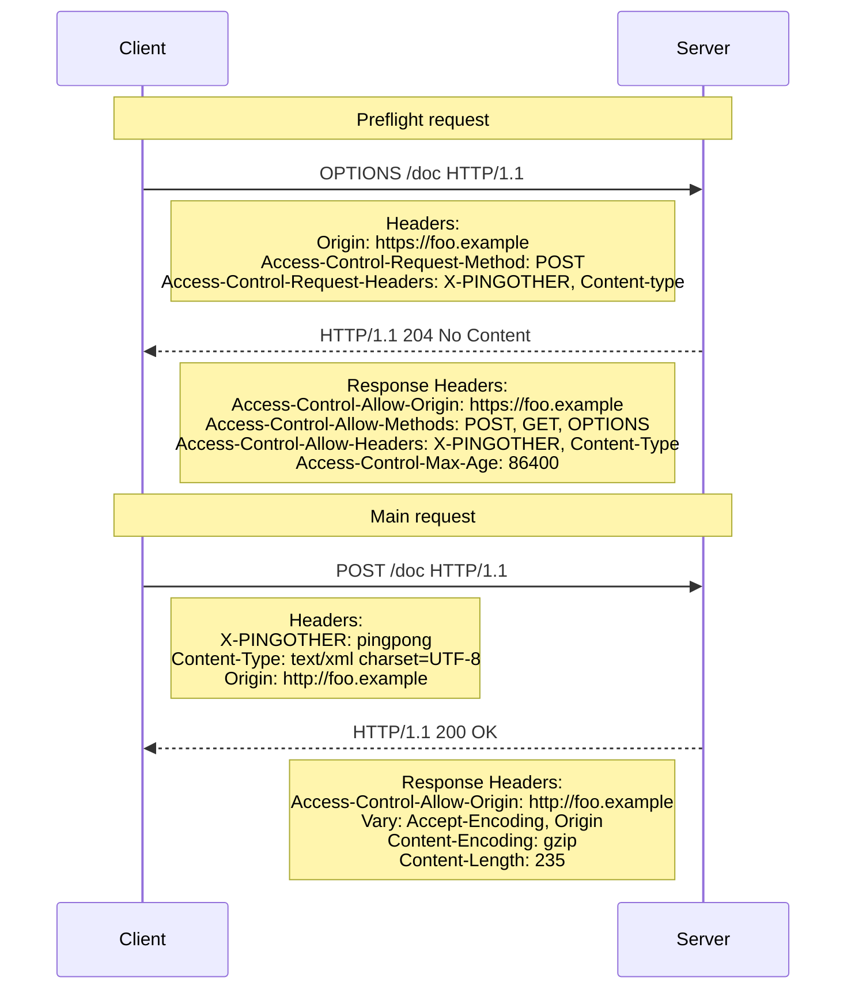

# REST API Documentation

Good documentation can make or break our customer’s experience when integrating with Platform+ Tech APIs.

These practices are the minimum guidelines for building your Swagger documentation in order to be more digestible for internal and external developers. Additionally, using these standards will allow your documentation to be properly formatted on the Platform+ Tech API Catalog Console. You can also find this information, along with samples, [here](https://cloud.google.com/apigee/docs/apigee-x/develop/create-api-proxy#swagger_yaml).

If you are using a Java Spring app, a lot of this can be generated for you in code. If you have a serverless (eg. Cloud Function) backed API, you'll have to manually manage your own open api spec files.

These standards are intended to increase clarity of your documentation and maintain consistency across API’s. Addressing these recommendations in your Swagger documentation will both improve your codebase, as well as help internal and external developers to work with your services.

## API Description

- A clear, detailed description of the purpose of the API at a high level.
- This should be between 2-3 sentences and describes the purpose of the API and any additional concerns.

```yaml
swagger: "2.0"
info:
  description: "This is a sample server Petstore server. You can find out more about Swagger at [http://swagger.io](http://swagger.io) or on [irc.freenode.net, #swagger](http://swagger.io/irc/). For this sample, you can use the api key `special-key` to test the authorization filters."
  version: "1.0.0"
  title: "Swagger Petstore"
  termsOfService: "http://swagger.io/terms/"
  ...
```

## OpenAPI Version

- With the upcoming GCP migration, there is a hard limitation on using OpenAPI specification 2.0.
- Version 2.0 is recommended for net new documentation.
- Pre-existing API’s written in 3.0 should be downgraded to 2.0 when possible.

> For this reason, all of the following documentation assumes we're using version 2.0

## Grouping Operations

- Ensure that your operations are grouped under a single resource, using tags.
- For more information, see [this documentation](https://swagger.io/docs/specification/grouping-operations/).

```yaml
tags:
  - name: pets
    description: The API for managing your pets.
  - name: stores
    description: The API for managing pet store inventories
paths:
  tags:
  - name : pets
    description: the API to manage your pets
  - name : stores
    description: the API to manage your stores
  /pets/findByStatus:
    get:
      summary: Finds pets by Status
      tags:
        - pets
      ...
  /pets:
    post:
      summary: Adds a new pet to the store
      tags:
        - pets
      ...
  /stores/inventory:
    get:
      summary: Returns pet inventories
      tags:
        - stores
      ...
```

## Operation Descriptions/Summary

- Include a summary and description for each operation.
- The summary is a short description of the operation, while the description provides more detail and any additional information.
- Refrain from using the name of the handler as the summary for a method.
- Instead, you may choose to include the handler as the `operationId`.

```yaml
paths:
  /users:
    post:
      tags:
      - "users"
      summary: "Create user"
      description: "Creates a new user. This can only be done by the logged in user."
      operationId: "createUser"
      ...
```

## Parameters

- Include a short description for each parameter, along with its type, format, and whether or not it is required.

### Example Path Parameter

```yaml
parameters:
  - name: "petId"
    in: "path"
    description: "ID of pet to return"
    required: true
    type: "integer"
    format: "int64"
    ...
```

### Example Header

```yaml
parameters:
  - name: "x-user-id"
    in: "header"
    description: "ID of the user making the request"
    required: true
    type: "string"
    format: "uuid"
    ...
```

### Example Query Parameter

```yaml
parameters:
  - name: "startDate"
    in: "query"
    description: "The earliest date for your search"
    required: true
    type: "integer"
    format: "int64"
    ...
```

## Request & Response Objects

### Requests

- Describe your request body, utilizing a reference to an object in `schema`.
- For more information, see [this documentation](https://swagger.io/docs/specification/describing-request-body/).

## Example of referencing an object

```yaml
/user:
  post:
    tags:
    - "user"
    summary: "Create user"
    description: "Creates a new user. This can only be done by the logged in user."
    operationId: "createUser"
    produces:
    - "application/xml"
    - "application/json"
    parameters:
    - in: "body"
      name: "body"
      description: "Created user object"
      required: true
      schema:
        $ref: "#/definitions/User"
          ...
definitions:
  User:
    type: "object"
    properties:
      id:
        type: "integer"
        format: "int64"
      username:
        type: "string"
      firstName:
        type: "string"
    ...
```

### Response Objects

- Similarly, we can reference objects defined in the `definitions` section in our responses.
- In the following example, the `/user` endpoint has three possible responses, `200`, `500` and `401`.
- Each response has a description, but only the `200` responses will return data in its body.
- So, it also has a `schema` property, which references the `User` object.

```yaml
/user
...
responses:
  200:
    description: Created a User object
    schema:
      $ref: '#/definitions/User'
  500:
    description: "Internal Server Error"
  401:
    description: "Unauthorized"
definitions:
  User:
    type: "object"
    properties:
      id:
        type: "integer"
        format: "int64"
      username:
        type: "string"
      firstName:
        type: "string"
         ...
```

### Primitive Responses

- In the rare case that your endpoint will only return a simple value, like a string or a number, you can just define that value in the response.
- You do NOT need to define a response schema in this case.
- In the following example, the HTTP `200` response to a `POST` request to the `/users` endpoint will return the id of the newly created user.
- These responses should still include a description, and if possible, they should include a format.
- You can find information on valid [formats here](https://swagger.io/docs/specification/data-types/) along with more information on [describing responses](https://swagger.io/docs/specification/describing-responses/).

```yaml
/users
  post:
...
    responses:
      '200':
        description: OK
        content:
          string:
            schema:
              type: string
              format: uuid
              description: The unique id of the new user
```

## Defining Request & Response Schemas

- As we mentioned before, any object used in your API should be included in the `"definitions"` section of your open api spec.
- You can check out the [Input and Output Models](https://swagger.io/docs/specification/models/) section of the swagger documentation for more info.

```yaml
definitions:
  User:
    type: "object"
    properties:
      id:
        type: "integer"
        format: "int64"
      username:
        type: "string"
      firstName:
        type: "string"
         ...
```

- In this example, we've defined a `User` object.
- It has the type of `"object"` and it has `id`, `username` and `firstName` properties.

## Difference Between GET and POST Objects

- When data is saved by our back-end, fields are often populated automatically (ID, createdAt, updatedAt, etc...).
- These fields can often be ignored by our end users, and aren't necessary in the object our users post to our APIs.
- This is one reason why it is considered good practice to use separate schemas when defining objects used for POST and GET requests.

## Objects returned by GET requests

- In this example, the `Location` object has `id`, `created` and `updated` fields.
- All of these fields would be populated automatically by our back-end.
- And they would be included in the response for any GET requests for that record.

```yaml
Location:
    type: "object"
    properties:
      id:
        type: string
        format: uuid
        description: The unique identifier for this location
     latitude:
        type: number
        format: float
     longitude:
        type: number
        format: float
    created:
        type: number
        format: int
        description: The unix timestamp of when this location record was created
    updated:
        type: number
        format: int
        description: The unix timestamp of when this location was last updated
         ...
```

## Objects sent in POST or PUT requests

- In the previous example, the `Location` schema had `id`, `created` and `updated` fields that were all auto-populated by the server.
- Because they were auto-populated, our users don’t have to worry about them when they make a POST request to make a new record.

- So in this example, the `LocationDTO` (Data Transfer Object) does not have those fields.
- We've also added a list of required fields to help the user when they're building their requests.

```yaml
LocationDTO:
    type: "object"
    required: [latitude, longitude]
    properties:
     latitude:
        type: number
        format: float
     longitude:
        type: number
        format: float
          ...
```

## Security

- [Swagger 2.0 security](https://swagger.io/docs/specification/authentication/)
- [Open API 3.0](https://swagger.io/docs/specification/authentication/)

- Create a `securityDefinitions` (securitySchemas in OpenAPI 3) section and add entry for our auth headers.

- In this example, we've created a security definition called `ApiKeyAuth`, which requires a header called 'authorization'

```yaml
  Security Definitions:
    APIKeyAuth:
      type: apiKey
      in: header
      name: authorization
          ...
```

- Once you've defined your security definition, you can either apply it globally, or on a per endpoint basis.
- To define it globally, just add a `security` section to the root level of your spec.
- If you need to mix and match security types, add a `security` section to each endpoint.

```yaml
  Security Definitions:
    -APIKeyAuth: []

  paths:
    /something:
      get:
        security:
          - ApiKeyAuth: []
```

## CORS

### Purpose of CORS

- Cross Origin Request Sharing (CORS) extends the same-origin policy by controlling which domains can access your application resources and what data will be sent with the requests. This serves as a layer of defense to prevent unauthorized access and ensure the security of your application.

### When to implement CORS

- Platform+ Tech endpoints should implement CORS only when accessed by other origins through web browsers. Requests from desktops or server-side applications do not require CORS considerations.



### Additional Configuration Guidance 
- If your endpoint includes path params (in this example, the id parameter) then make sure to include them in the parameters section of your options request as well.
- For the allowed headers, include any headers used by your endpoint, including default headers (X-Correlation-Id, etc...).
- Limit the use of a wildcard '*' configuration to API's that are completely public and don’t handle sensitive data. If your API has CIA rating of 5 or lower and defining allowed origins presents a significant challenge, an exception can be requested through the API Exception Office Hours to use a wildcard configuration. For additional help and guidance, contact the Platform+ Cybersecurity team via the #cyber-security slack channel.
- Use the Access-Control-Allow-Methods header to limit CORS requests to only the operations that require CORS policies, when technically feasible.
- Avoid setting the Access-Control-Allow-Credentials header to "True" unless completely necessary, as this enables authentication data to be sent with cross-origin requests.
- For added flexibility of CORS configurations, consider setting the origin header value as an environment variable outside of the application. Externalizing CORS configurations allows for dynamic, scalable, and maintainable solutions that can reduce the TTR of cross-origin issues.

### Reference Resources
- Find information on CORS functionality and implementation via the [Mozilla Developer CORS Documentation](https://developer.mozilla.org/en-US/docs/Web/HTTP/CORS).
- Explore documentation on CORS implementation in Spring applications in the [Dev Enablement Guide](https://github.company.com/DevEnablement/pcfdev-guides/tree/master/security/cors-configuration).
- Follow Organization Policy requirements for CORS configuration in line with industry best practices, emphasizing the principle of least privilege. Refer to the [API Technical Requirements Standard](https://www.policyportal.company.com/policyportal/download/0902225a80edc412), pages 12-14, for detailed CORS requirements.

## There should be No Errors

Open your spec in a swagger editor and make sure there are no errors.

If you see something like this:


… then you need to make changes.


This is especially useful when switching between OpenAPI 3.0 and 2.0
