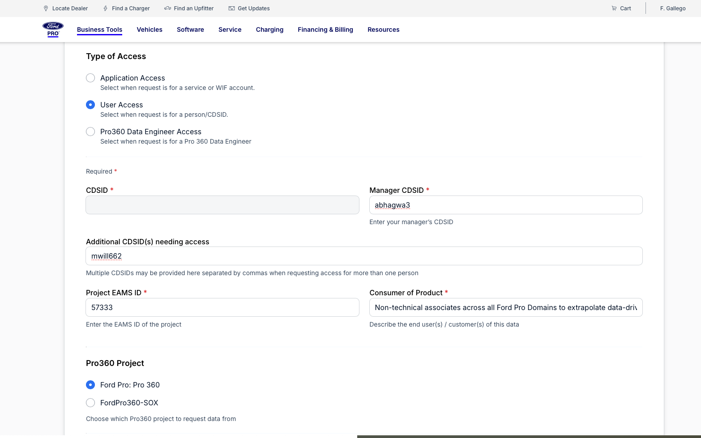
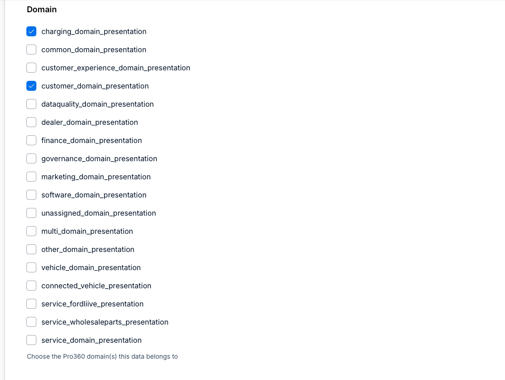
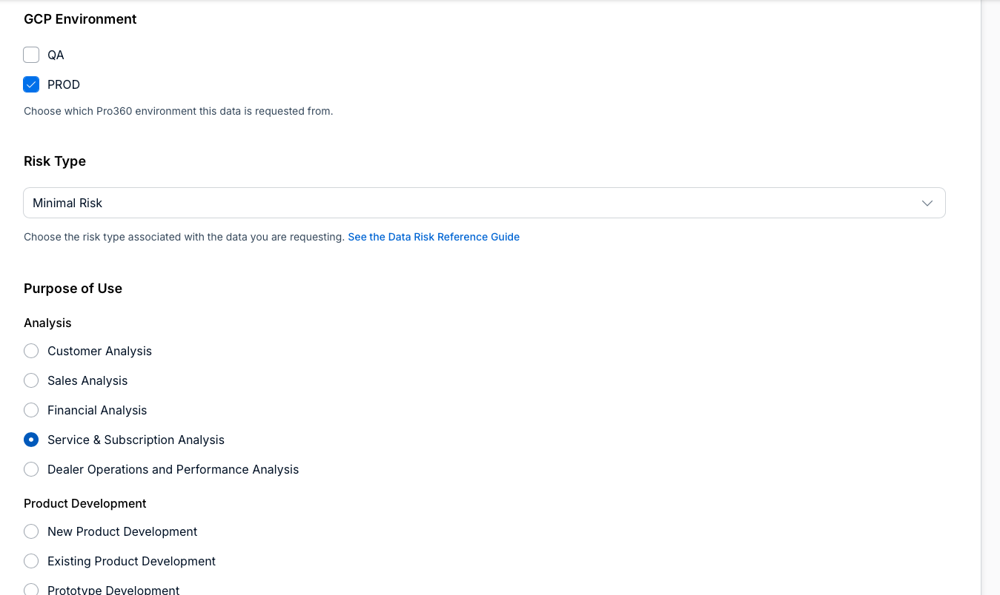
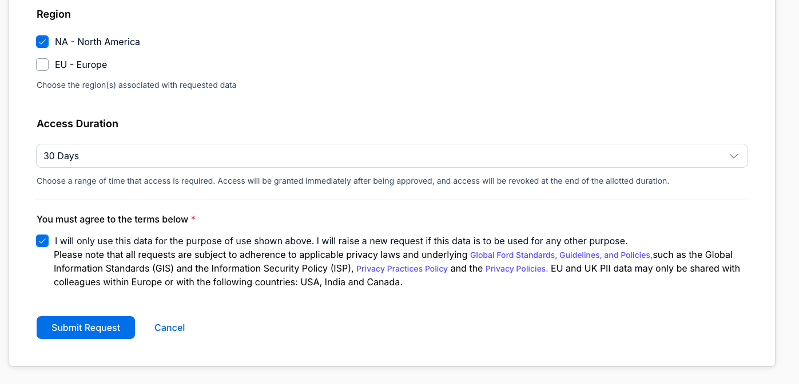
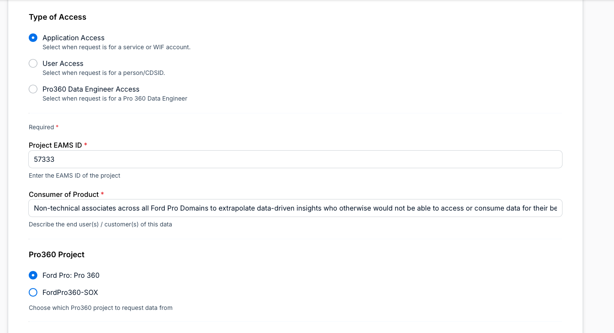
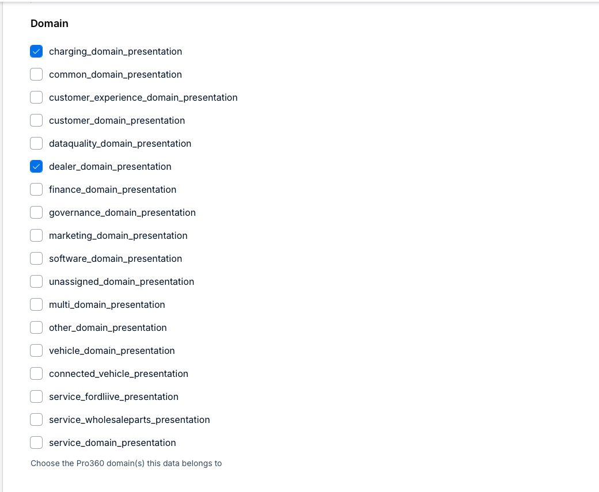
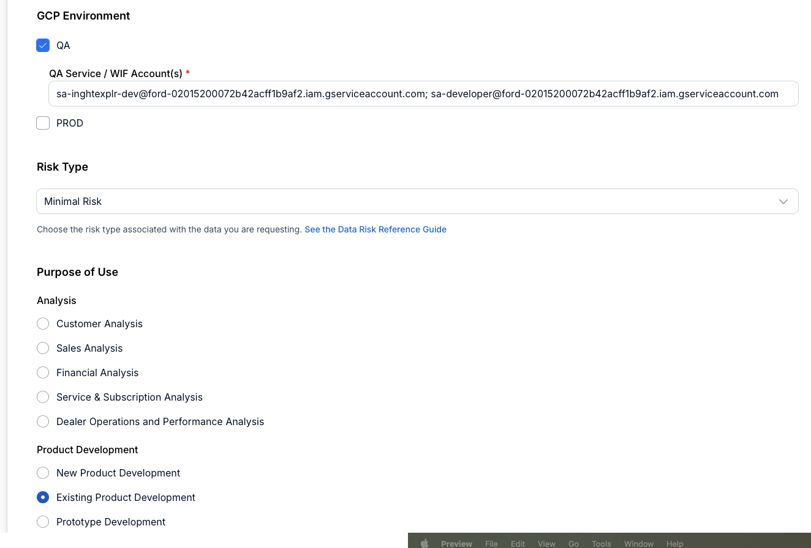

## Request Access to Pro360 -- Users(s) and App(s) Level

[Fill out this Form (VPN Required)](https://www.enterprise.com/en-us/data-governance/access-request/)

The Pro360 Governance team will evaluate your request for approval.  
Key Prerequisite: your CDSID must be aligned with to a product with an EAMS ID answered on this form. The GCP Project(s) in which you will access the data must be associated with the EAMS ID for a Product (i.e. Insights Explorer is 57333 as shown below). You and those you are requesting data access for must be associated with the EAMS ID product. 
Please work with your product manager on getting an appropriate GCP cloud project set up using this link:   
[Create GCP Project (VPN Required)](https://www.cloudportal.company.com/gcp/bundle)   
Please contact Data Governance Technical Anchor Tajinder Singh (TSINGH54) for any ensuing issues with access, querying, and approval status.   

## Notes and Answers for all Form Questions to optimize approval for Individual Access: 
#### Step 1: User Access
#### Step 2: Your own CDSID is filled out by default. Put your manager's CDSID in the box to the right. If applicable, put all other CDSIDs needing access. 
#### Step 3: Put your Project's EAMS ID. Please discuss this with your product manager if you do not know this. 
#### Step 4: Describe the end user(s) / customer(s) of the data. Example: "Non-technical associates across all Platform+ Domains to extrapolate data-driven insights who otherwise would not be able to access or consume data for their benefit." 
#### Step 5: Pro360 Project: Platform+: Pro 360

#### Step 6: Please select which domains your data will use

#### Step 7: GCP Environment: QA (for development environments); PROD (for production/implementation environments).
#### Step 8: Select Risk Type Access (PII). Please reference Data Risk Reference Guide as needed to make your decision.
#### Step 9: Please select Purpose of Use from the below topics. 

#### Step 10: Please select Region (NA or EU)
#### Step 11: Give access duration.
#### Step 12: Please attest to the terms.
#### Step 13: Submit

## Notes and Answers for all Form Questions to optimize approval for App Level (Service Account / WIF) Access: 
#### Step 1: App Access
#### Step 2: Put your Project's EAMS ID. Please discuss this with your product manager if you do not know this. 
#### Step 3: Describe the end user(s) / customer(s) of the data: Example: "Non-technical associates across all Platform+ Domains to extrapolate data-driven insights who otherwise would not be able to access or consume data for their benefit."
#### Step 4: Pro360 Project: Platform+: Pro 360

#### Step 6: Please select which domains your data will use

#### Step 7: GCP Environment: QA (for development environments); PROD (for production/implementation environments). Enter in names of Service Accounts / WIF Accounts as needed. 
#### Step 8: Select Risk Type Access (PII). Please reference Data Risk Reference Guide as needed to make your decision.
#### Step 9: Please select Purpose of Use from the below topics. 

#### Step 10: Please select Region (NA or EU)
#### Step 11: Give access duration.
#### Step 12: Please attest to the terms. 
#### Step 13: Submit

