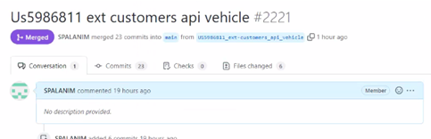

# Python
Majority of our code base is written in python. While writing python code, please make sure to use the following standards for consistency.
## Formatting:
For formatting of code, please use pep8 standard. Regardless of whatever IDE you use, please set your IDE to use this formatting. We will have less code changes to review in our PR if we all use the same formatting.

## Variables:
For variable names in your code, use snake_case. And as a general practice, please do not feel restricted in having long variable names. It’s ok to have long variable names as long as they define what those variables are being declared for.

## Comments in Code:
Please remove comments in code before sending code for PR reviews. We would like to merge code with comments in higher branches.

## No Secrets in Code:
We cannot have secrets hardcoded in code. There are three ways to pass secrets to your application.
* Tekton Secrets (Free)
* Airflow Variables (Free)
* GCP Secrets Manager (Costly)

# SQL
We have been writing SQL code within python code itself. We would like to avoid that as much as possible from now on. We would want our SQL code witten in a separate .SQL file instead of python code but parameterized when executing that SQL from your python code, treat them as fstrings in python to replace the parameterized variables.

*  E.g., A .sql file can have something like this below.
*  select id from `{project_id}.{commercial_dataset}.{orders_dimension_table}`;

Then in your python code, once you read the sql from that file, you can do this:
`above_sql_read_from_file`.format(project_id=project_id,    commercial_dataset=commercial_dataset,  orders_dimension_table=orders_dimension_table>)

In addition to this, while writing your Bigquery SQL, for optimizing your query in terms of cost and speed, please refer to this documentation.

[Organization Big Query Best Practices - Saved Original.docx (sharepoint.com)](https://sharepoint.company.com/:w:/s/AnalyticsArchitecture/EcK627JhlrVOsAO4fKeQD9UBTffrvpc7xsTnPhCIA6KNHQ)

# Unit Testing
Python code that you write should have corresponding unit test cases written for it. We will use unit_test python library for this purpose. The CI/CD pipeline that is deploying your code to GCP should have unit_test task added in your pipeline. The coverage for any additional code that you write needs to be >= 80%.

# Terraform
For terraform, please format your terraform code before pushing upstream.
terraform fmt --recursive .\infrastructure\

# OIC Controls Standards 

## Change Control Process in Practice: 1 Page Summary
[Link here](https://sharepoint.company.com/:w:/r/sites/ProTechAnalytics/Shared%20Documents/2024%20OIC%20Controls/Pro_Analytics%20PG_change_control_1pager.docx?d=w3490fe71dcd6428688c43f1491a9a54b&csf=1&web=1&e=Mo6Sdr)

:::danger
We have agreed to these standards to be implemented as of May 1st, 2024. Please follow these standards carefully for future (inevitable) audits
:::
1.	All production releases must be associated with a Rally artifact (`user story/defect`), documenting the change
2.	All production PRs must cross-reference the corresponding Rally artifact (`US/defect #`):

3.	Successful `UAT` must be evidenced with `documentation` (eg – screenshots &/or approval from business partner vs PLA vs anchor, etc).

:::info
note: UAT approver will vary depending on the type of change (ie – business requested change vs tech debt, etc)
:::

4.	Evidence of UAT must be attached to the associated `Rally artifact` *before* the Prod deploy
5.	Team PMs are `business owner delegates`; therefore, have final approval authority based on the `Delegation of Authority Specificiations`. [Delegation of Authority Forms](https://sharepoint.company.com/:f:/r/sites/ProTechAnalytics/Shared%20Documents/2024%20OIC%20Controls/Delegation%20of%20Authority%20Forms?csf=1&web=1&e=NPpi9e)
6.	`Team PMs` are responsible for ensuring that all Rally artifacts have evidence of UAT before changing the artifact status = to the team equivalent of ready for production (ie – completed or accepted)

:::info
note: by verifying UAT evidence + progressing the Rally artifact status, the team PM is providing all required forms of approval
:::

