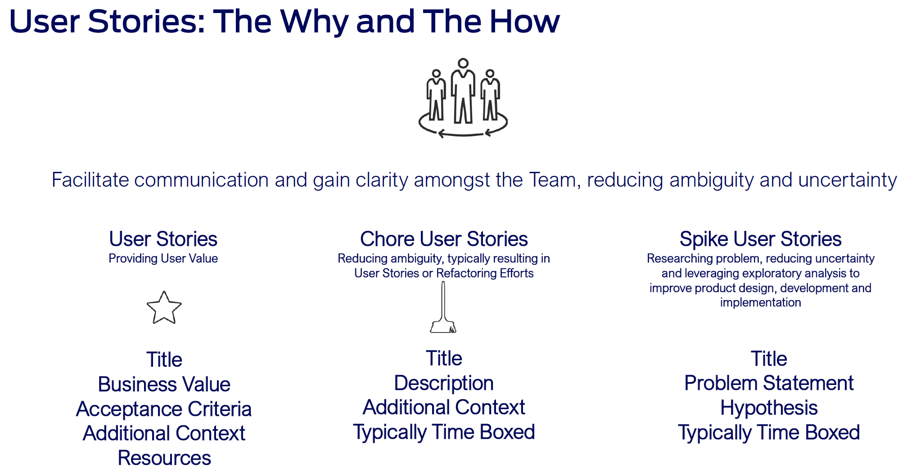
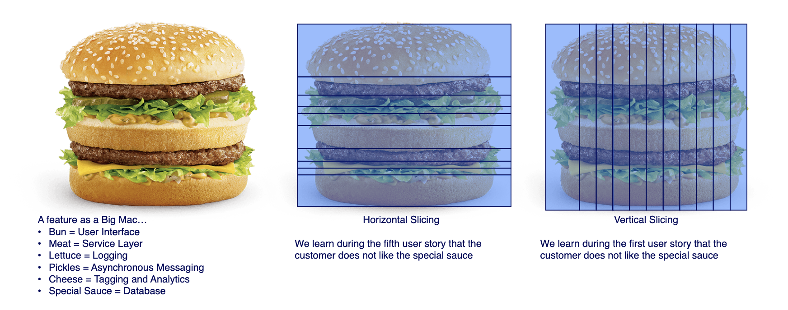

# Backlog Artifact Basics

# User Story Writing: The INVEST Framework
The INVEST framework provides a set of guidelines for writing effective user stories. Each characteristic ensures clarity, testability, and value.

## I - Independent
- **What:** A user story can be developed and released without dependencies on other stories.
- **Why:** Reduces work in progress (WIP), simplifies release notes, and minimizes scope creep.
- **How:** Avoid mid-development dependencies; ensure a vertical slice (UI, application logic, database); acceptance criteria define the scope.

## N - Negotiable
- **What:** The story is open to discussion and refinement based on team input.
- **Why:** Prevents details from becoming stale, empowers engineers, and fosters collaboration.
- **How:** Aim for 65-75% detail upfront; use the "I want [capability]" format; avoid specifying technology, tools, or implementation details.

## V - Valuable
- **What:** Delivers tangible value to the end user.
- **Why:** Minimizes rework, increases customer satisfaction.
- **How:** Specify the end user ("As a [persona]"); define the value ("So that [value recognized by persona]"); align with larger goals or core business capabilities.

## E - Estimable
- **What:** The development team can estimate its relative complexity.
- **Why:** Improves delivery timeline stability, aids prioritization, and promotes discussion.
- **How:** Estimate relative to previous stories; use a consistent estimation scale; ensure sufficient understanding of technical implementation, testing, and delivery.

## S - Small
- **What:** As small as possible while providing real user value.
- **Why:** Enables faster feedback cycles and more confident estimates.
- **How:** Find the least common denominator of value; size to ensure a manageable estimate (e.g., +/- 2 days); avoid stories so small that overhead outweighs benefits.

## T - Testable
- **What:** Contains acceptance criteria that guide testing.
- **Why:** Reduces risk of unforeseen challenges; helps prioritize based on testing effort.
- **How:** Define outputs and scenarios; use Gherkin syntax (Given, When, Then).

## User Story Examples: Addressing Common Issues
The following examples illustrate how to improve user stories by addressing common issues:

### As a... I want... So that...

This is the classic user story format that helps the team center its efforts around the benefit we are trying to create for the user. Most often used for a user story but can also be used for features, sub-epics and epics.

- As a [User persona] 
- I want to [task you want to be able to perform]
- So that [the value I derive from the activity]

### Rethinking the Slice: Vertical vs. Horizontal
When breaking down Features/User Stories, remember to provide incremental value and reduce risk. Vertical slicing delivers pieces of each aspect in a smaller form, providing a better idea of the full experience and faster value. Horizontal slicing delivers only a part of the final product.

### Example 1: Unclear User
**Before:**
- As a user
- I want to be able to filter search results
- So that I can find what I need more quickly.

**After:**
- As a frequent shopper (power user)
- I want to be able to filter search results by brand, price, and size
- So that I can quickly find the specific items I'm looking for and complete my purchase efficiently.

### Example 2: Broad Scope
**Before:**
- As a user
- I want a great online shopping experience
- So that I'll keep coming back.

**After:**
- As a returning customer,
- I want a streamlined checkout process that remembers my information
- So that I can complete my purchase quickly and easily.

### Example 3: Too Technical
**Before:**
- As a developer
- I want to implement a RESTful API using Node.js and Express.js
- So that the frontend can access data efficiently.

**After:**
- As an administrator
- I want to be able to manage user accounts through a web interface
- So that I can efficiently add, update, and delete users.

### Example 4: Unclear User Value
**Before:**
- As a user
- I want to be able to upload files
- So that I can use the system.

**After:**
- As a project manager
- I want to be able to upload project documents to a shared repository
- So that team members can easily access the latest versions and collaborate effectively.

### What/Why/Done (Additional User Story Format)
What/Why/Done

Answers the basic questions that the team needs to answer to get started on working. This works real well for platform features where the "AS A USER..." format feels awkward.

- What are We Doing?
   - What specific capabilities are we asking to be created?

- Why are We Doing It?
   - What is the justification for doing this work? It should be aligned to business objectives, user experience and/or improving our technical posture. Sometimes we are doing it just because we have to (legal/mandatory) make sure to call that out as well.

- What does it Look Like to be Done?
   - Acceptance criteria that will demonstrate to us that the work is complete.

- Exclusions
   - Is there anything relevant to this work that should not be included in the completion of this work?

- Other Notes
   - Great way to pass along additional context to the team.
   - Link to Miro Board
   - Link to Design Mockups
   - Technical Implementation Notes
   - Key Contacts

### Acceptance Criteria Guidelines
- Acceptance criteria are testable statements with clear pass/fail results.
- They should state intent, not a specific solution.
- Consider functional, non-functional, and performance criteria.

**Format:** Given [precondition], When [action], Then [expected result].

### General Tips and Tricks
- Focus on progress, not perfection.
- Prioritize the concept over specific methodologies.
- Acknowledge that planning is inherently imperfect.
- Encourage all team members to share their perspectives.
- Ensure shared understanding of the product vision (short-term, mid-term, long-term).