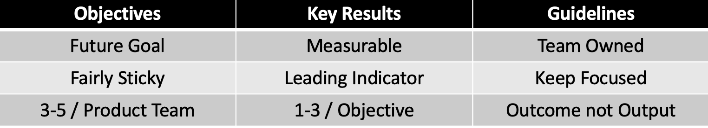
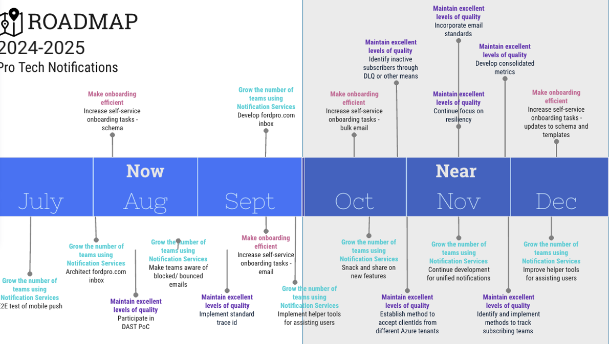

## Objectives and Key Results (OKRs) Foundations

## Metrics Frameworks: Guiding Measurement
Several frameworks can help clarify the connection between OKRs and product metrics, ensuring effective goal setting.

### 1. HEART Framework
The HEART framework provides a structured approach to measuring product success across five key dimensions:

- **Happiness:** Measures overall user satisfaction. Example Metric: Average Customer Satisfaction Score (CSAT) from post-interaction surveys.
- **Engagement:** Measures active user interaction. Example Metric: Average session duration.
- **Adoption:** Measures the rate of new user acquisition. Example Metric: Weekly new user sign-ups.
- **Retention:** Measures user retention over time. Example Metric: Monthly recurring revenue (MRR) churn rate.
- **Task Success:** Measures the effectiveness of task completion. Example Metric: Percentage of users successfully completing a key onboarding task.

### 2. AARM Metrics Framework™
This framework measures product success across the user journey:

| Category     |                                              | Example                                      |
|--------------|----------------------------------------------|----------------------------------------------|
| Acquisition   | Signing Up                                   | # of App Downloads                           |
| Activation   | Completing the sign-up or onboarding process | # of people who complete the sign-up process |
| Retention    | Engaging with the product and reducing Churn | Daily Active # of posts per user             |
| Monetization | Generating Revenue                           | Average revenue per user                     |

Source:
Lin, Lewis C.. [Decode and Conquer, 3rd Edition](https://www.amazon.com/Decode-Conquer-Answers-Management-Interviews/dp/0615930417) (p. 115). UNKNOWN. Kindle Edition.

### Northstar Framework
Amplitude's North Star Framework identifies a single key metric reflecting the core product value. The entire product strategy aligns with improving this metric. This provides a clear direction, ensures common goals, and maximizes impact.
[Learn More](https://amplitude.com/resources/north-star-playbook?utm_source=google-ads&utm_medium=cpc&utm_campaign=Search_AMER_US_EN_NorthStarPlaybook&utm_content=157380485011&utm_term=north%20star%20metric&gad_source=1&gclid=EAIaIQobChMIt-yVwo6SgwMVN1lHAR0S9wOEEAAYASAAEgKRffD_BwE)

### Applying Frameworks: A Practical Example
This example demonstrates how to use OKRs and the HEART framework.

#### Notifications Product Team Roadmap

##### Establishing Context for OKR Definition

**Context:** The Notification Team is part of the Platform Engineering Product Group, focusing on four key pillars: Fast, Secure, Resiliant, Adoption. OKRs should align with these pillars. The team tracks the number of email templates (lagging indicator) and hypothesizes that reducing the time (leading indicator) to create new templates will increase the number of templates.

**Defining the OKR**
- **Pillar:** FAST
- **Objective:** Make Onboarding More Efficient
- **Leading Indicator:** Reduce Notification Team support time by 95% per new template.
- **Lagging Indicator:** Increase the number of email templates.

**Resulting OKR Statement**
We believe that making onboarding more efficient will reduce Notification Engineering Support time by 95%, resulting in an increase in the number of onboarded email templates.